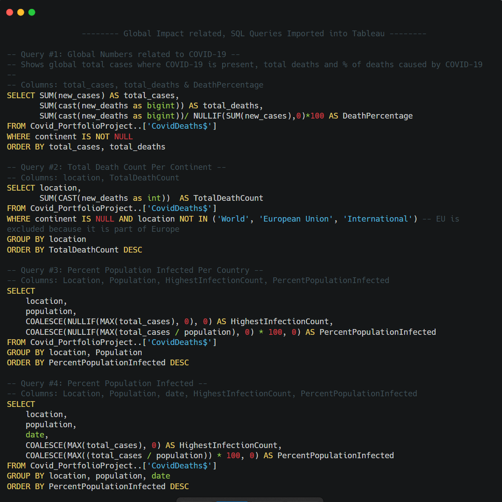

# COVID-19_SQL_Tableau_Dashboard
[Portfolio Link](https://yattavit.github.io/)

[Tableau Dashboard Link](https://public.tableau.com/app/profile/ysook/viz/COVID-19Dashboard_16891358862960/COVID-19DeathsInfectionUpdated06072023) | [GitHub Repository Link](https://github.com/yattavit/COVID-19_SQL_Tableau_Dashboard)

## Introduction
**Timeframe of Analysis in [DD/MM/YYYY]: From 01/01/2020 to 06/07/2023**

This project focuses on visualizing COVID-19 infection and death data using Tableau. It aims to provide a visual representation of the detrimental impact of COVID-19 on a global scale & within the SEA region.

The dataset used in this analysis is obtained from ['Our World in Data'](https://ourworldindata.org/covid-deaths)

## Tableau Dashboard

The Tableau Dashboard created for this project can be found in the link below:  
[Tableau Dashboard Link](https://public.tableau.com/app/profile/ysook/viz/COVID-19Dashboard_16891358862960/COVID-19DeathsInfectionUpdated06072023)

## Features present in Dashboard
Both pages present within the Tableau storyboard contains the features below:
-   Global Numbers: A text table showcasing total cases, total deaths and percentage of death present on global scale & within the SEA region.
- Total Death Count per Continent/Country: A horizontal bar chart displaying the total COVID-19 deaths across continents & within the SEA region, facilitating comparison.
-   Percent Population Infected: A geographical representation of the percent of population infected by COVID-19 in different countries, allowing for comparative analysis.
-   Percent Population Infected: A line chart illustrating the percentage of population infected by COVID-19 across various countries over time, capturing the trajectory of the pandemic.

### SQL Code Blocks used for Tableau Visualization

## Observations
Based on the dataset, From 01/01/2020 to 06/07/2023, we observe that:
> On a Global Scale:

- The mortality rate from COVID-19 is about 0.91%
- The continent which have the highest count of deaths in descending order are as follows:
	- Europe
	- Asia
	- North America
	- South America
	- Africa
	- Oceania

> Within the SEA region:
- The mortality rate from COVID-19 is about 1.02%
- The country with the highest reported # of COVID-19 related deaths is Indonesia
- Conversely, Singapore is ranked fourth with respect to having the least amount of COVID-19 related deaths in SEA
	- This is in spite of it having the 2nd highest percentage of population whom are infected with COVID-19 within the region [~44.47%].
		- This may be attributed to Singapore's robust healthcare system, early intervention measures with strong vaccination campaign, effective contact tracing & public compliance with guidelines. The country's effective healthcare system and public health communication from authorities have collectively contributed to limiting severe outcomes during the pandemic.
